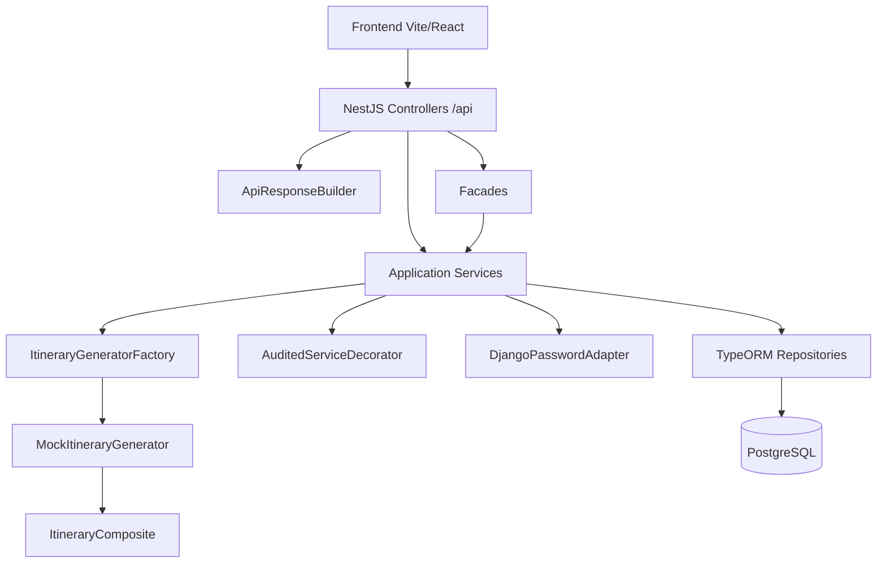
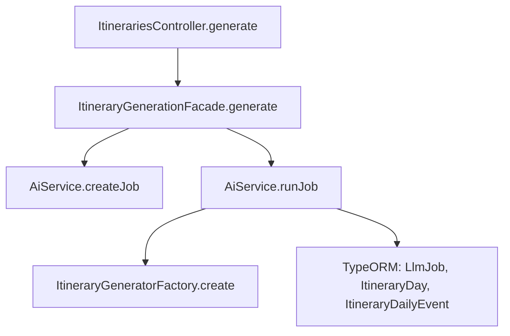
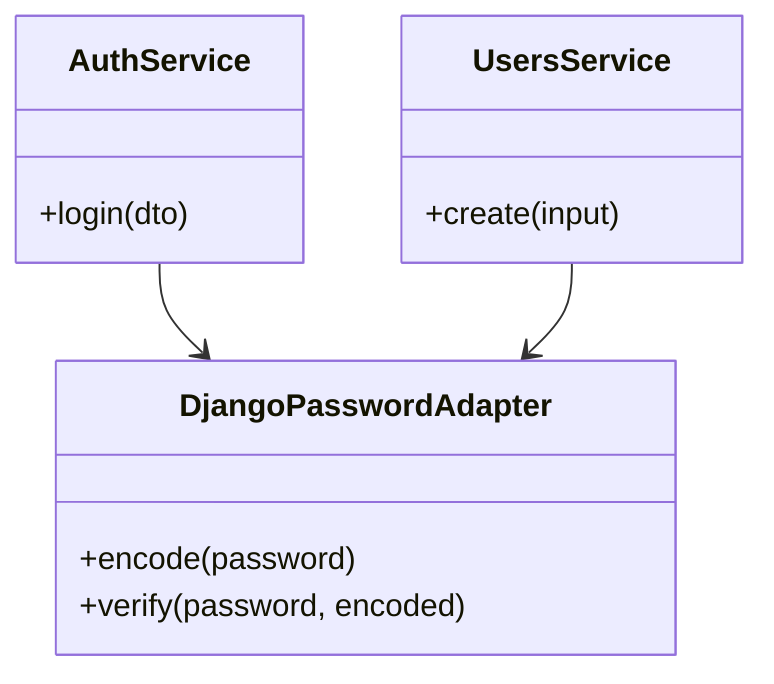
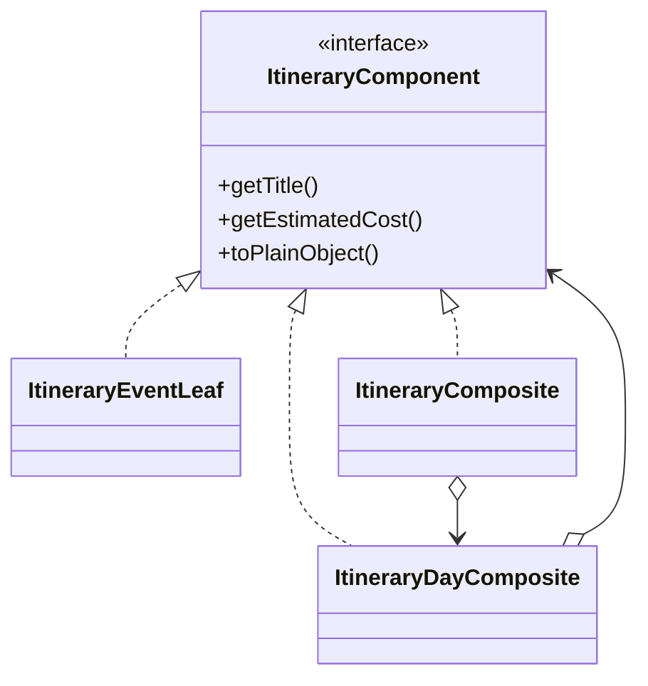
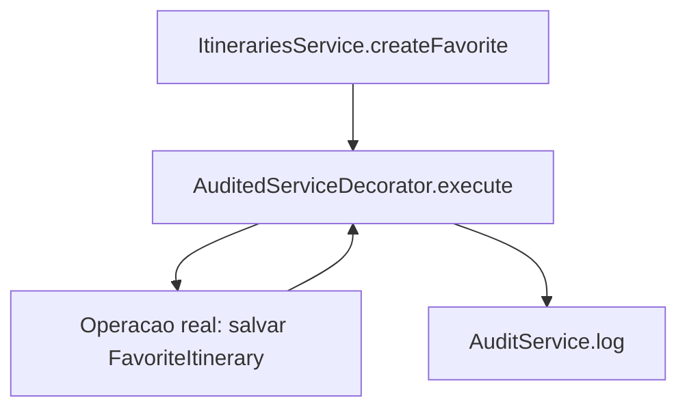
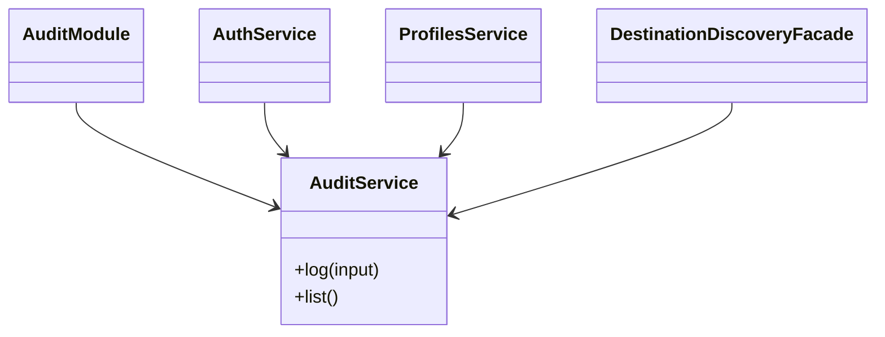
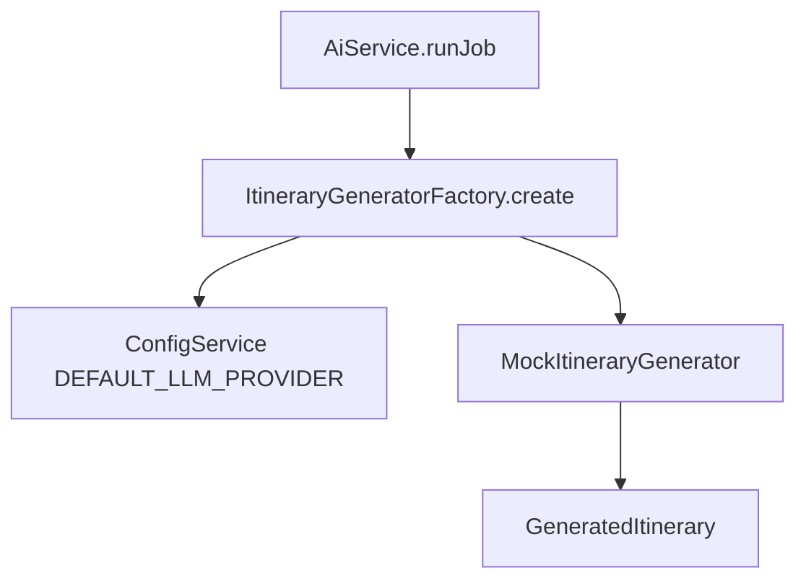
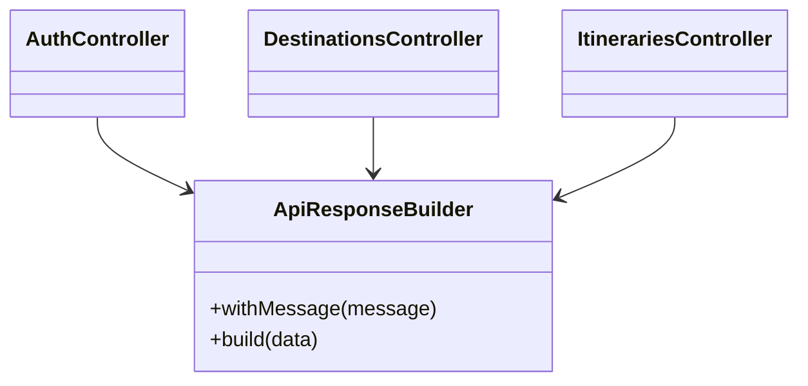

# Design Patterns utilizados na migração Django → NestJS

O backend original foi construído em Python, Django REST Framework e PostgreSQL. A nova implementação em `backend-nest/` reconstrói os principais contratos da API em NestJS, TypeScript, TypeORM, DTOs, `class-validator`, Dependency Injection e PostgreSQL.

A migração manteve o Django intacto. Os models Django foram usados como referência para entidades TypeORM, serializers viraram DTOs/presenters, viewsets viraram controllers e services/funções de domínio viraram services Nest.

## Arquitetura geral da solução



## 1. Facade

### 1. Definição

Facade oferece uma interface simples para uma operação que envolve vários objetos ou subsistemas.

### 2. Problema encontrado no projeto

No Django, gerar roteiro exige mudar status do roteiro, criar LLM job, escolher gerador, buscar perfil/preferências/POIs, persistir dias/eventos e auditar. Esse fluxo não deve ficar espalhado no controller.

### 3. Solução adotada

`ItineraryGenerationFacade` expõe `generate(itinerary, userId)` e esconde a coordenação com `AiService`.

### 4. Onde foi implementado

`src/common/facades/itinerary-generation.facade.ts`

Classes envolvidas: `ItinerariesController`, `ItineraryGenerationFacade`, `AiService`, `ItineraryGeneratorFactory`.

### 5. Fluxo



### 6. Trecho de código

```ts
@Injectable()
export class ItineraryGenerationFacade {
  constructor(private readonly aiService: AiService) {}

  async generate(itinerary: Itinerary, userId: number): Promise<LlmJob> {
    const job = await this.aiService.createJob(itinerary, userId);
    return this.aiService.runJob(job.id);
  }
}
```

### 7. Impacto

Reduz acoplamento do controller, concentra o caso de uso e facilita testar geração sem atravessar HTTP.

### 8. Vantagens

Controller mais simples, fluxo de geração mais legível, dependências concentradas.

### 9. Desvantagens / trade-offs

Adiciona uma camada a mais; para casos muito simples seria desnecessário.

### 10. Justificativa

O fluxo de geração é realmente orquestrado e envolve múltiplos serviços e entidades, então a Facade evita controller anêmico com muitas dependências diretas.

## 2. Adapter

### 1. Definição

Adapter converte uma interface/formato externo para uma interface esperada pela aplicação.

### 2. Problema encontrado no projeto

Usuários existentes no banco Django usam senha no formato `pbkdf2_sha256$iterations$salt$hash`. O Nest não entende isso nativamente.

### 3. Solução adotada

`DjangoPasswordAdapter` encapsula encode/verify do formato Django. `AuthService` depende desse adapter, não do detalhe criptográfico.

### 4. Onde foi implementado

`src/common/adapters/django-password.adapter.ts`

Classes envolvidas: `AuthService`, `UsersService`, `DjangoPasswordAdapter`.

### 5. Fluxo



### 6. Trecho de código

```ts
verify(password: string, encoded: string): boolean {
  const [algorithm, iterationsText, salt, expected] = encoded.split('$');
  const actual = pbkdf2Sync(password, salt, Number(iterationsText), 32, 'sha256').toString('base64');
  return algorithm === 'pbkdf2_sha256' && actual === expected;
}
```

### 7. Impacto

Preserva compatibilidade com o banco Django e evita espalhar lógica de hash pela autenticação.

### 8. Vantagens

Reuso, testabilidade isolada, menor dependência do legado.

### 9. Desvantagens / trade-offs

A aplicação passa a conhecer um formato legado enquanto houver usuários migrados.

### 10. Justificativa

Sem esse adapter, usuários já cadastrados no Django não conseguiriam autenticar no Nest.

## 3. Composite

### 1. Definição

Composite permite tratar objetos individuais e composições com a mesma interface.

### 2. Problema encontrado no projeto

Roteiros possuem hierarquia real: `Itinerary -> ItineraryDay -> ItineraryDailyEvent`. Custo e serialização precisam considerar níveis diferentes.

### 3. Solução adotada

`ItineraryComponent` é a interface comum. `ItineraryEventLeaf` representa evento, `ItineraryDayComposite` agrupa eventos e `ItineraryComposite` agrupa dias.

### 4. Onde foi implementado

`src/modules/itineraries/itinerary-composite.ts`

Usado por `src/modules/ai/itinerary-generators.ts`.

### 5. Fluxo



### 6. Trecho de código

```ts
getEstimatedCost(): number {
  return this.children.reduce((total, child) => total + child.getEstimatedCost(), 0);
}
```

### 7. Impacto

Centraliza cálculo de custo e mantém o gerador independente do detalhe de cada nível.

### 8. Vantagens

Modela a hierarquia real, facilita extensão para blocos futuros, simplifica cálculo agregado.

### 9. Desvantagens / trade-offs

Exige classes extras para uma operação que poderia ser calculada com loops simples.

### 10. Justificativa

A estrutura de roteiro é naturalmente composta, então o padrão representa o domínio sem artificialidade.

## 4. Decorator

### 1. Definição

Decorator adiciona comportamento a um objeto sem modificar sua implementação original.

### 2. Problema encontrado no projeto

Operações como favoritar roteiro precisam executar lógica principal e auditoria. Misturar auditoria em cada operação aumenta duplicação.

### 3. Solução adotada

`AuditedServiceDecorator` recebe uma operação com `execute`, chama a operação real e registra auditoria depois.

### 4. Onde foi implementado

`src/common/decorators/audited-service.decorator.ts`

Usado em `src/modules/itineraries/itineraries.service.ts` no método `createFavorite`.

### 5. Fluxo



### 6. Trecho de código

```ts
const operation = new AuditedServiceDecorator(
  { execute: (input) => this.favorites.save(this.favorites.create({...})) },
  this.audit,
  'itinerary.favorited',
  () => userId,
);
```

### 7. Impacto

Auditoria fica transversal e reutilizável, sem alterar a operação decorada.

### 8. Vantagens

Menos duplicação, comportamento adicional explícito, fácil testar isoladamente.

### 9. Desvantagens / trade-offs

A leitura exige entender uma indireção a mais.

### 10. Justificativa

Auditoria é comportamento transversal real no sistema Django e aparece em diversos viewsets.

## 5. Singleton

### 1. Definição

Singleton garante uma única instância compartilhada de uma classe durante o ciclo de vida da aplicação.

### 2. Problema encontrado no projeto

Auditoria deve ser um serviço central e consistente, compartilhado por auth, destinos, perfis e roteiros.

### 3. Solução adotada

`AuditService` é provider Nest padrão. O container de DI cria uma instância única por módulo/aplicação e injeta a mesma dependência onde necessário.

### 4. Onde foi implementado

`src/modules/audit/audit.service.ts`

Registrado e exportado em `src/modules/audit/audit.module.ts`.

### 5. Fluxo



### 6. Trecho de código

```ts
@Injectable()
export class AuditService {
  constructor(@InjectRepository(AuditLog) private readonly logs: Repository<AuditLog>) {}
}
```

### 7. Impacto

Centraliza criação de logs e padroniza metadata/event_type.

### 8. Vantagens

Menor duplicação, ciclo de vida controlado pelo Nest, dependência fácil de mockar.

### 9. Desvantagens / trade-offs

Serviços singleton não devem guardar estado mutável por request.

### 10. Justificativa

O Nest resolve o Singleton via DI; criar singleton manual com `static instance` seria pior e menos testável.

## 6. Factory

### 1. Definição

Factory centraliza a criação ou escolha de implementações.

### 2. Problema encontrado no projeto

O Django escolhe gerador de roteiro conforme provider (`mock`, `gemini`). O Nest precisa manter esse ponto de extensão.

### 3. Solução adotada

`ItineraryGeneratorFactory` lê `DEFAULT_LLM_PROVIDER` e retorna um `BaseItineraryGenerator`.

### 4. Onde foi implementado

`src/common/factories/itinerary-generator.factory.ts`

Usado em `src/modules/ai/ai.service.ts`.

### 5. Fluxo



### 6. Trecho de código

```ts
create(): BaseItineraryGenerator {
  const provider = this.config.get<string>('DEFAULT_LLM_PROVIDER', 'mock');
  if (provider === 'mock') return new MockItineraryGenerator();
  return new MockItineraryGenerator();
}
```

### 7. Impacto

Isola a decisão de provider e prepara inclusão futura de Gemini/Groq sem mudar `AiService`.

### 8. Vantagens

Extensível, baixo acoplamento, configuração centralizada.

### 9. Desvantagens / trade-offs

Enquanto só há mock, a Factory parece mais complexa que instanciar diretamente.

### 10. Justificativa

O backend Django já tem variação real de provider, então a Factory preserva esse ponto arquitetural.

## 7. Builder

### 1. Definição

Builder constrói objetos complexos passo a passo.

### 2. Problema encontrado no projeto

O Django padroniza respostas com `{ success, message, data }`. Repetir esse objeto em todos os controllers aumentaria duplicação.

### 3. Solução adotada

`ApiResponseBuilder` monta respostas com `withMessage(...).build(data)`.

### 4. Onde foi implementado

`src/common/builders/api-response.builder.ts`

Usado pelos controllers de auth, users, destinations, profiles, itineraries, ai e audit.

### 5. Fluxo



### 6. Trecho de código

```ts
return this.response
  .withMessage('Registro carregado com sucesso.')
  .build(data);
```

### 7. Impacto

Mantém compatibilidade do contrato DRF e reduz código repetitivo.

### 8. Vantagens

Padronização, legibilidade, menor chance de respostas divergentes.

### 9. Desvantagens / trade-offs

Para respostas simples, adiciona uma chamada a mais.

### 10. Justificativa

O envelope de resposta é requisito de compatibilidade com o frontend e com o backend Django.

## Comparação Django x NestJS

| Django / DRF | NestJS |
| --- | --- |
| `apps.users.models.User` | `User` TypeORM Entity |
| `apps.destinations.models.Destination` | `Destination` TypeORM Entity |
| `ModelSerializer` | DTOs + entities + presenters |
| `ViewSet` / `@action` | `Controller` + rotas REST |
| `StandardResponseMixin` | `ApiResponseBuilder` + `ApiExceptionFilter` |
| `permissions.IsAuthenticated` | `JwtAuthGuard` |
| SimpleJWT | `@nestjs/jwt` + `JwtStrategy` |
| `validate_*` / `validate` | `class-validator` + validação em service |
| `ItineraryGenerationService` | `AiService` + `ItineraryGenerationFacade` |
| `get_generator()` | `ItineraryGeneratorFactory` |

## Antes da aplicação dos padrões

Sem os padrões, controllers teriam que conhecer detalhes de auditoria, geração, senha Django, cálculo de custos e envelope de resposta. A criação de roteiro misturaria fluxo de job, provider, persistência e serialização no mesmo método.

## Depois da aplicação dos padrões

`ItinerariesController` delega geração à Facade. `AuthService` valida senha pelo Adapter. `AiService` recebe gerador pela Factory. O cálculo de estrutura do roteiro usa Composite. Auditoria transversal em favorito usa Decorator. Respostas são montadas pelo Builder. `AuditService` é singleton gerenciado pelo DI.

## Decisões arquiteturais

| Decisão | Justificativa |
| --- | --- |
| `backend-nest/` separado | Preserva o Django intacto. |
| `synchronize: false` | Evita recriar/destruir tabelas PostgreSQL existentes. |
| Nomes de tabelas Django nas entities | Compatibilidade com schema atual. |
| DTOs com `class-validator` | Reproduz validações de serializers. |
| JWT Bearer | Mantém contrato de autenticação do frontend. |
| Wrapper `{ success, message, data }` | Compatibilidade com `StandardResponseMixin`. |
| Facades/services | Evita lógica extensa em controllers. |

## Tabela resumo

| Padrão | Categoria | Implementação | Problema resolvido | Principal impacto |
| --- | --- | --- | --- | --- |
| Facade | Estrutural | `ItineraryGenerationFacade` | Orquestrar geração de roteiro | Controller simples e caso de uso centralizado |
| Adapter | Estrutural | `DjangoPasswordAdapter` | Compatibilizar senha Django | Login de usuários existentes |
| Composite | Estrutural | `ItineraryComposite` | Hierarquia roteiro/dias/eventos | Cálculo agregado e modelo de domínio claro |
| Decorator | Estrutural | `AuditedServiceDecorator` | Auditoria transversal | Reuso sem alterar operação principal |
| Singleton | Criacional | `AuditService` via DI Nest | Serviço compartilhado de auditoria | Consistência e baixo acoplamento |
| Factory | Criacional | `ItineraryGeneratorFactory` | Escolher gerador LLM | Extensibilidade para providers |
| Builder | Criacional | `ApiResponseBuilder` | Respostas padronizadas | Compatibilidade com DRF |

# Roteiro para apresentação acadêmica

| Padrão | Problema | Onde abrir | Classes para demonstrar | Diagrama |
| --- | --- | --- | --- | --- |
| Facade | Geração coordena muitos passos | `src/common/facades/itinerary-generation.facade.ts` | `ItineraryGenerationFacade`, `AiService` | Fluxo da Facade |
| Adapter | Senhas Django pbkdf2 | `src/common/adapters/django-password.adapter.ts` | `DjangoPasswordAdapter`, `AuthService` | Classe Adapter |
| Composite | Roteiro possui árvore real | `src/modules/itineraries/itinerary-composite.ts` | `ItineraryComposite`, `ItineraryDayComposite`, `ItineraryEventLeaf` | Class diagram Composite |
| Decorator | Auditoria sem duplicação | `src/common/decorators/audited-service.decorator.ts` | `AuditedServiceDecorator`, `ItinerariesService.createFavorite` | Fluxo Decorator |
| Singleton | Auditoria compartilhada | `src/modules/audit/audit.service.ts` | `AuditService`, `AuditModule` | Class diagram Singleton |
| Factory | Provider de geração configurável | `src/common/factories/itinerary-generator.factory.ts` | `ItineraryGeneratorFactory`, `MockItineraryGenerator` | Fluxo Factory |
| Builder | Envelope DRF repetido | `src/common/builders/api-response.builder.ts` | `ApiResponseBuilder`, controllers | Class diagram Builder |
